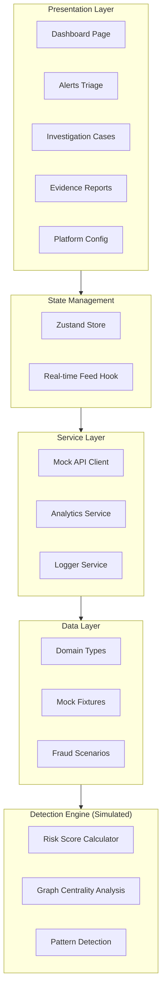

# FinTrace AI — System Architecture

## Overview

FinTrace AI is a real-time financial crime detection platform that models transaction networks as graphs, applies machine learning risk scoring, and provides investigators with a complete decision cockpit.

## Architecture Layers



## Data Flow

```
Transaction Stream → Graph Construction → Pattern Detection → Risk Scoring → Alert Generation → Investigation → Evidence Export
```

1. **Ingest**: Simulated transaction stream feeds the system at configurable throughput
2. **Model**: Transactions are modeled as directed graph edges between entity nodes
3. **Detect**: Pattern detection identifies layering, structuring, round-tripping, and dormant activation
4. **Score**: ML models assign risk scores with explainable factor breakdowns
5. **Alert**: High-risk patterns generate prioritized alerts for analyst triage
6. **Investigate**: Analysts manage cases with actions, SLA tracking, and audit trails
7. **Report**: Evidence packages are generated for regulatory filing

## Risk Scoring Model

| Factor | Weight | Description |
|---|---|---|
| Layering Score | 25% | Multi-hop fund flow through intermediaries |
| Structuring Score | 25% | Sub-threshold transaction patterns |
| Velocity Score | 20% | Transaction frequency anomalies |
| Profile Mismatch | 15% | Deviation from expected entity behavior |
| Geographic Risk | 15% | Jurisdiction and geo-location risk factors |

Combined model: `IF_v2.3 + GraphCentrality_v1.4` with confidence scoring.

## Technology Decisions

| Decision | Rationale |
|---|---|
| React 19 + Vite 8 | Fast HMR, modern tooling, production-ready build |
| Zustand over Redux | Minimal boilerplate for prototype, excellent DX |
| Tailwind CSS 4 | Rapid UI development with consistent design system |
| Mock data over MSW | Simpler setup for demo; MSW can be added later |
| React Router 7 | File-based mental model, nested layouts |
